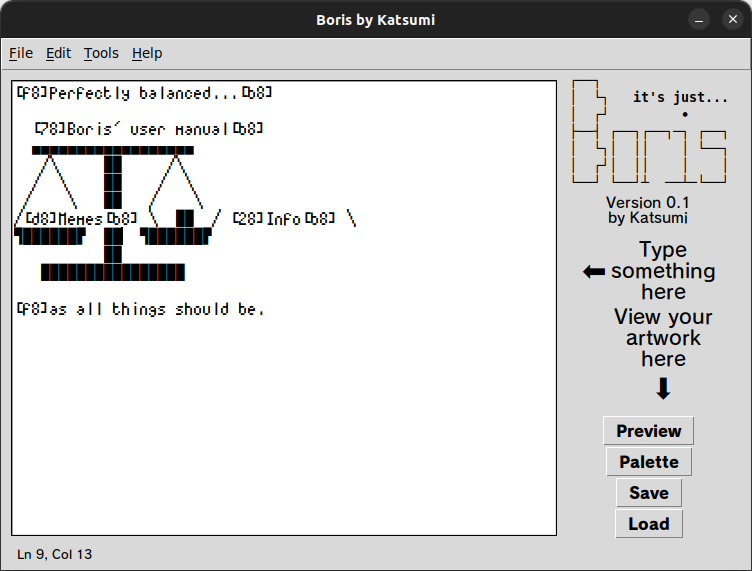
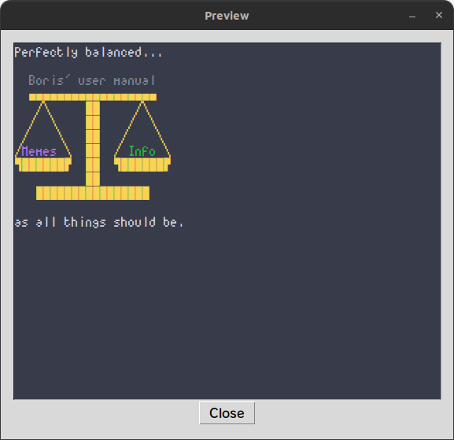
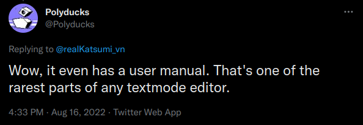

# It's... *Boris*!

*Boris* is a [text mode/ASCII art](http://polyducks.co.uk/what-is-textmode/) editor written by the same wimp behind [*izanagi-neo*](https://github.com/KatsumiKougen/izanagi-neo), Katsumi.

Unlike the traditional go-to software for creating ASCII art, [Windows Notepad](https://en.wikipedia.org/wiki/Windows_Notepad), *Boris* offers the ability to create colourful artworks with full 16-colour palette.

*Boris* is written in Python 3.10 — Katsumi's favourite programming language, making it easily customisable.

# How to use

*Boris* is designed to be simple and straightforward for users. But of course, one would still need a user manual.

You can find the user manual [here](./manual.md).

# Created by...

Your friendly neighbour Katsumi.

Find me on social media:

| Facebook | https://facebook.com/KatsumiKougen |
|:---------|:-----------------------------------|
| Twitter  | https://twitter.com/realKatsumi_vn |
