```
+------------------------------------------------------------------------------+
|                                                                              |
|                          Snooping as usual,  I see?                          |
|                              ¯¯¯¯¯¯¯                                         |
|           ""|""""".     .-"""-.    ""|""""".    """|"""   .-"""-.TM          |
|             |      \   /       \     |      \      |     /       V           |
|             |      /  |         |    |      /      |     \                   |
|             |_____/   |         |    |_____/       |      ""---__            |
|             |     \   |         |    |'.           |             \           |
|             |      \  |         |    |  '.         |             |           |
|             |      /   \       /     |    '.       |     N       /           |
|           __|____.'     '-___-'    __|__  __\_  ___|___  |'-___-'            |
|                                                                              |
|                   The New Textmode Editor  for the New Era                   |
|                  written in Python 3.10 | by Katsumi Kougen                  |
|                                                                              |
|         |  | /""\ |""" |""\    |\ /|    ^    |\  | |  |    ^    |            |
|         |  | '-_  |__  |__/    | V |   / \   | \ | |  |   / \   |            |
|         |  |    | |    |'.     |   |  /---\  |  \| |  |  /---\  |            |
|         \__/ \__/ |___ |  \    |   | /     \ |   | \__/ /     \ |___         |
|                                                                              |
+------------------------------------------------------------------------------+
```

# Introduction

Oh, hello there!

Welcome to ***Boris*' User Manual**. The purpose of this manual is to show you how to use the text mode editor *Boris* as well as the concept of text mode art (or ASCII art or whatever sh\*t you wanna call).

So, without further ado, let's get started!

```
            .-------.
           (""""-----)                 |"""""""""""""|
            \_/\__/\/                  |  Squadala!  |
           < (|)(|)  >                 |  We're off! |
           <__ VV __>       ______----""__-----------'
    .__     -_\';|__       __"""""""""""
     '-==\""" \\:// """"/=-'
        | |    \|/    ||
        "-"""|  V  |"""
             / /   |
   .-""""""";------(""".-'
.-'        (___/___).-'
""""""""""""""""""""
```

# Getting Started

## Before running *Boris*...

*Boris* is written in Python 3.10, and therefore takes advantage of Python 3.10's features. If you want to run the program, you need to have Python 3.10 installed on your computer.

If you already have Python 3.10 installed, you're good to go. If not, go install it [here](https://python.org). As a reminder to Windows users, Python 3.10 won't run on Windows 7 or earlier. If your PC runs Windows 7 or earlier, tough sh\*t.

*Boris* uses these following libraries: *tkinter*, *clipboard*, and *Pillow*. The former is bundled with Python 3, but the latter two have to be installed manually.

In the [`fonts`](./fonts) folder are the fonts used by the program. For Linux users, please install only these fonts:

* FOT-RodinNTLGPro-EB.otf
* rodinpro-db_bigfontsite.com.otf
* jgs5.ttf

For Windows users, just install all of 'em.

## Introduction to text mode art/ASCII art

### [What the f\*ck is a "text mode art"?](https://www.youtube.com/watch?v=ZB0fDrpmKTg)

Text mode art is a broad term for art made with a monospaced font on a uniform grid. The term arose from a need to categorise art that didn't use a specific specification.

In the same way that "tile art" encapsulates pixelart, mosaic, sprite art, "text mode art" covers a great many different subcategories. Textmode encapsulates art like ASCII (not [AZKi](https://www.youtube.com/channel/UC0TXe_LYZ4scaW2XMyi5_kw)), ANSI, PETSCII and many others which have their own specific restrictions.

Old computers used to have various modes for displaying graphics — with high resolution modes for displaying pixel art with varying degrees of colour, and often a text mode for displaying uniform tiles of text characters in units of one character, one foreground colour and one background colour. This was beneficial because it required less RAM to display large, colourful graphics.<sup>`[1]`</sup>

### Why? And how?

Let me show you how text mode actually works, in case you still don't understand. We'll start with the text mode on the CGA:

> To show graphics on the screen, your graphics card needs to have memory. Otherwise it would forget instantly what it should be drawing. 
> It has to remember every detail that is on the screen.
> 
> Modern graphics cards have thousands of millions of bytes of memory on them, but things were very different with early graphics cards.
> 
> The CGA, which came with the original IBM PC, only had sixteen kilobytes of memory. That's literally hundreds of thousands times less than a typical graphics card on the market today.
> 
> The text mode display on the CGA is made of 80 character cells side by side, on 25 distinct rows. Each of these cells is eight pixels wide, and eight pixels tall. If we do some quick mathematics, that's 128000 pixels. Furthermore, each of these characters can have 16 distinct colours for both the foreground and the background. If this data was indeed represented as pixels, this would mean four bits per pixel, and the total would therefore be 512000 bits, or 64000 bytes. The poor CGA definitely did not have that much memory. 😵‍💫️ It only had 16000 bytes, enough for only monochrome graphics at this resolution.
> 
> To get around this problem, they stored the text mode data differently. Instead of storing each individual pixel in the memory, they would only store character cells. Each of these 80×25 cells can only have one of 256 possible character symbols. Additionally there is an attribute for each cell; the attribute can specify one of 16 distinct different foreground colours and 8 distinct background colours, either blinking or not blinking. If we do some quick mathematics, that's 80 ⋅ 25 ⋅ (1 + 1) = 4000 bytes = 4 kilobytes, which is adequate enough for the CGA. Yes, 1000 bytes is one kilobyte. *(You wanna start a debate? Read [this](https://en.wikipedia.org/wiki/Kilobyte#Definitions_and_usage) first.)*
> 
> Unfortunately, this means that you cannot show arbitrary graphics in this mode. That's what the "*only*" in "*text-**only** mode*" refers to. These 256 characters are what you have, that's all. Of course some of these symbols are not so much text, and clever souls were able to utilize it for cool graphics.<sup>`[2]`</sup>

In a nutshell, text mode art is a general term for tile art which is:

* Created from a fixed two colour tileset (usually a 1-bit font)
* On a uniform grid
* With at most a single foreground and background colour per character<sup>`[1]`</sup>

> **References:**
> 
> * `[1]` ["*What is textmode?*" — Polyducks](http://polyducks.co.uk/what-is-textmode/)
> * `[2]` ["How I got Mario in That Editor — And how Norton got 🐁" — ](https://www.youtube.com/watch?v=7nlNQcKsj74)[Joel "Bisqwit" Yliluoma](https://bisqwit.iki.fi)

# Using Boris

To launch Boris from the command line, enter either of these commands:

```bash
python3 boris.py
```

```bash
./boris.py
```

This is for Linux users. Windows users surely know how to launch the program.

## Main window

The main window looks like this:


On the left, we have a 60×25-character textbox. The textbox is where you type down your work and add the "tags" to certain parts of the text. On the right, we have (from top to bottom) the program's wordmark, a text that tells you where things are, and four buttons: **Preview**, **Palette**, **Save** and **Load**.

On the bottom is a text that reads `Ln ..., Col ...`. This text indicates the current position of the cursor. So if the cursor is located in line 69, character 420, the text changes to `Ln 69, Col 420`.

There's a menu bar containing several basic commands like opening a file, copying some text, changing foreground and background colour, etc.

## Creating your first text mode artwork

### First things first

Let's start by typing some text. I'll go with this one: "[I'm really feeling it!](https://en.wikipedia.org/wiki/Xenoblade_Chronicles_(video_game))"

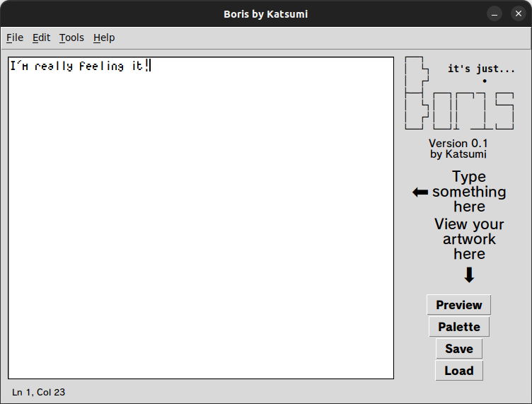

Once we click **Preview**, we get this result:

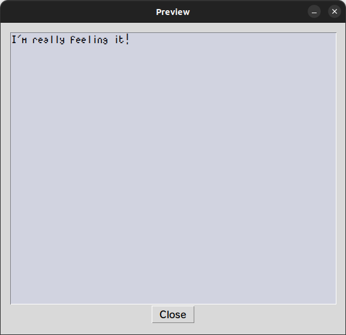

It looks fairly impressive. But there's no colours yet. Looks like we'll have to add some colour tags, which is my favourite part. 😄️


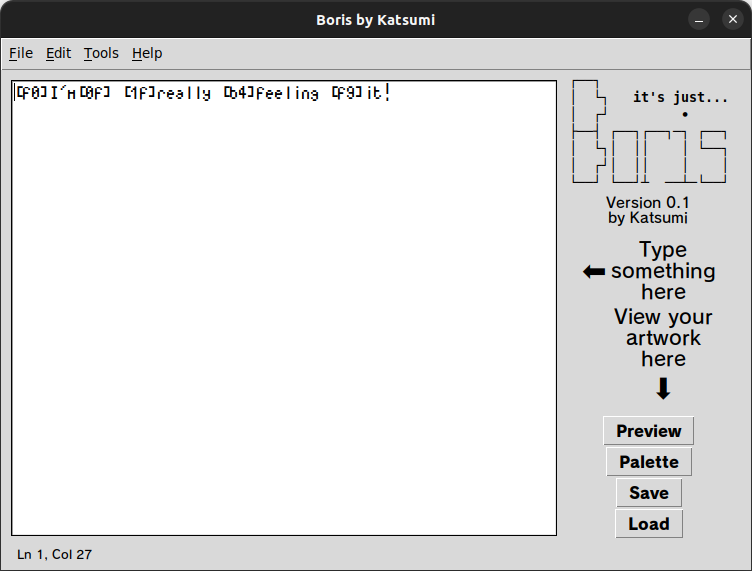

We click **Preview** again, and look at that: there is colour!

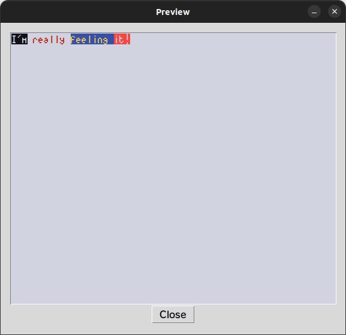

The program parses the text inside the textbox, divides the text into small sections and assigns each section to the preceding colour tag. When the user clicks **Preview**, the program takes these informations and then renders a picture based on these informations, as seen in the screenshot above.

| Section 1 | Section 2 | Section 3 | Section 4  | Section 5 |
|:---------:|:---------:|:---------:|:----------:|:---------:|
| [f0]      | [0f]      | [1f]      | [b4]       | [f9]      |
| `I'm`     | ` `       | `really ` | `feeling ` | `it!`     |

### The colour tags

In *Boris*, you add colours by adding colour tags.

Right before each section is a colour tag. It defines the foreground and background colour of that section, from the first character after the tag all the way to the character before the next tag. The "colour tag" concept is based on one of [Polyducks](http://polyducks.co.uk/)' [projects](https://fungi.neocities.org/). Unlike Polyducks' project, however, *Boris* lets you define not just the foreground — but background colour, allowing for more colourful and impressive works (and yes, I know there are other text mode editors that let you do the same thing, but I digress. Besides, my program makes it way easier to do).

Adding a colour tag is fairly simple: you type a left square bracket, then two characters — which denote the foreground and background colour, respectively; then finally a right square bracket.

*Boris* assigns sixteen colours of the Linux terminal palette to these characters, respectively:

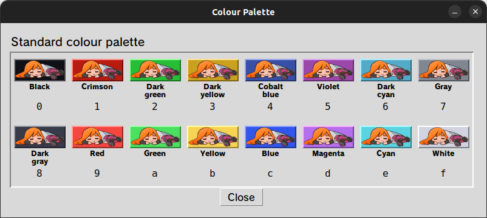

**Examples:**

| Colour tag | Foreground | Background |
|:----------:|:----------:|:----------:|
| [f0]       | White      | Black      |
| [0f]       | Black      | White      |
| [e1]       | Cyan       | Crimson    |
| [7b]       | Gray       | Yellow     |

The colour tag will not work if either/both of the characters within the brackets are uppercased or do not belong to these characters.

> ⚠️ **Attention!**
> 
> ----
> 
> The first and second character within the brackets *denote* the foreground and background colour, *respectively*. Do not mess that up — you don't wanna mess up your art!

> ⚠️ **Attention!**
> 
> ----
> 
> If you want to explicitly show the tags and not adding them to your art, you need to avoid closing the tags.
> 
> Let's say you have this text `[90][ab]solutely beautiful!`. If you convert it to a *Boris* picture, it outputs this:
> 
> 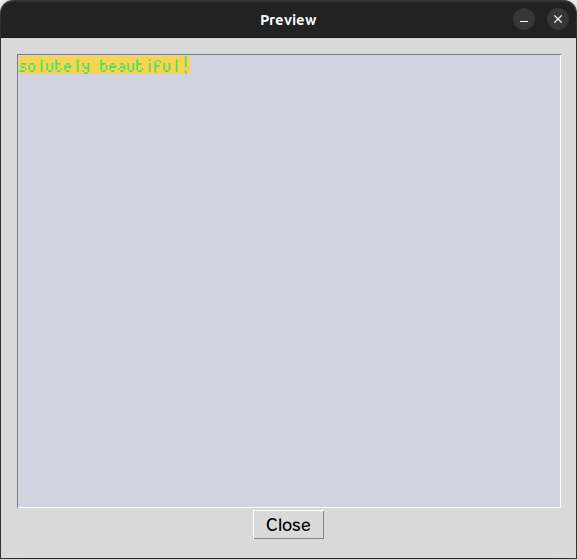
> 
> You can alleviate this by inserting a `[90]` tag inbetween `[ab]`, like this: `[90][ab`**`[90]`**`]solutely beautiful!`.
> 
> 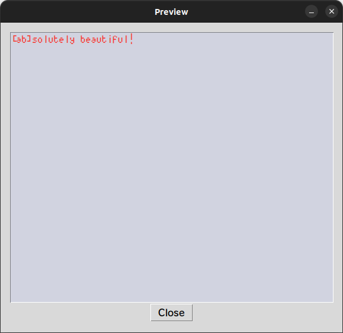

## Saving and loading your artwork

One of the most important part in every software is the ability to save and load something. In *Boris*; you can save your artworks anytime you want, with 3 (or 4) file formats to choose from; and you can load these artworks if you need to modify them a bit.

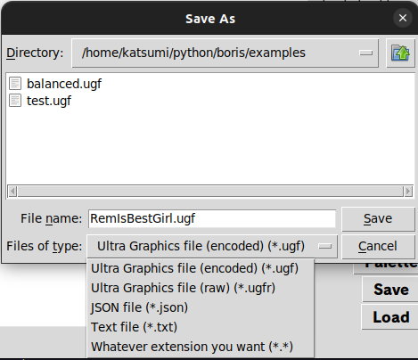

There are 4 different file formats that *Boris* supports:

* **Ultra Graphics file format** (or **UGF**) are a set of format for *Boris* artworks. They consist of two formats:
  * `.ugf` — The default UGF format. It comprises the file header, encoded data and a checksum for verification; the former two are encoded to prevent any attempt at compromisation.
  * `.ugfr` — The "raw" UGF format. Unlike `.ugf`, the data is left unencoded. `.ugfr` files are lighter than `.ugf` files in size, but are left open to compromisation.
* **JSON** — *The Format That Everybody Knows*. Like the UGF format, it also comprises the file header, encoded data and a checksum. Artworks saved in JSON format are human-readable but are more vulnerable than UGF and UGFR.
* **Plain text** — Because f\*ck it! Why not?

## Changing global foreground and background colour

*Boris* lets you change the global foreground and background colour. To do that, here's what you need to do: on the menu bar, click **Tools** ➡️ **Change Foreground and Background Colour**. Alternatively, you can press `Ctrl`+`Q` to achieve the same thing, if you don't like doing a little exercise.

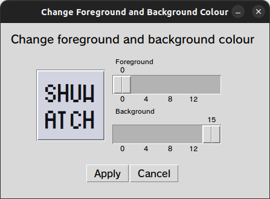

There are two horizontal scales — one for foreground and one for background. Dragging one of the sliders around the scale changes the preview box on the left. Once you've picked a foreground and background colour, click **Apply** to apply changes.

> ⚠️ **Attention!**
> 
> ----
> 
> There's a bug, that if you choose a foreground and background colour and click **Cancel** instead of **Apply**, the program still changes the global foreground and background colour to these colours. During the development, I was unable to fix this bug, and Google searches for creating a functional **Cancel** button came up empty. So if anyone want to fix this bug, feel free to contribute! This program is open-source after all!
> 
> 

## Character table

*Boris* uses Adel Faure's [*jgs5* font](./fonts/jgs5.ttf) for its textbox and previewing artworks. What makes this font unique compared to other monospaced fonts is that it is specifically designed for creating ASCII art.

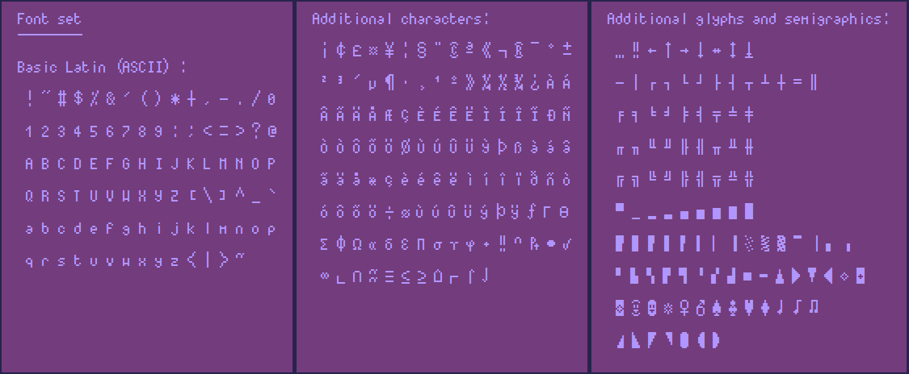

The font contains lots of additional characters that can be used to create fine details, and since some of you are using keyboards that do not have some of these characters, I added a character table containing many of these.

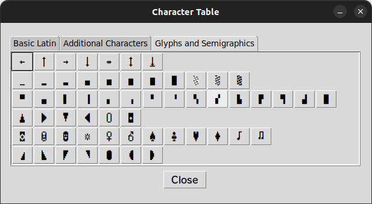

To open the character table, click **Tools** ➡️ **Character Table**, or press `F1`. The character table is splitted into three sections: **Basic Latin**, **Additional Characters** and **Glyphs and Semigraphics**. Within each section are the characters. To pick a character, click the button corresponding to that character, and that character will be copied to your clipboard.

# Final Words

Phew. We're finally done!

So, after reading this user manual, I hope that you've learnt how to use *Boris* to create text mode art.

To me, this whole project is undoubtedly stressful — I'd never thought it'd be so godawfully challenging. It took me about a week to write this program and also the user manual in a text editor (no IDE), all on a weak PC with only 2 MB of RAM. You read that right. Not only that, before I completely finished the program and started writing the manual, my PC had to be upgraded from Ubuntu 20.04 to 22.04, thus slowing down the process.

To be honest, I personally don't think *Boris* will become the best text mode editor you can get. I bet there are tons of softwares that can deliver the same stuffs that are as good as, if not, better than *Boris*. I'm not Linus Torvalds, Bjarne Stroustrup, James Gosling, Yukihiro Matsumoto or Guido van Rossum; I'm just an ordinary human, and my programming skill is just a fraction of theirs. I only wrote *Boris* not just because I can, but I wanted to deliver something amazing with all my available skills, to show you what I am truly capable of.

If you have a heart, please cherish this program as much as I do. It is open-source, you can freely do whatever you want with it — modify it, improve it, et cetera. You may share it to your friends and colleagues, but do not claim it yours; you may use it to create art, but don't make NFTs with it.

Thank you for reading this manual. Walk tall, my friend.

*Love — Katsumi Kougen*

----

<center>
It's only magic,<br>
Isn't it amazing when you know,<br>
Every second that you see is<br>
Twenty-four connected pieces<br>
Thank you for coming,<br>
Thank you for staying,<br>
Thank you for watching the show.
</center>
